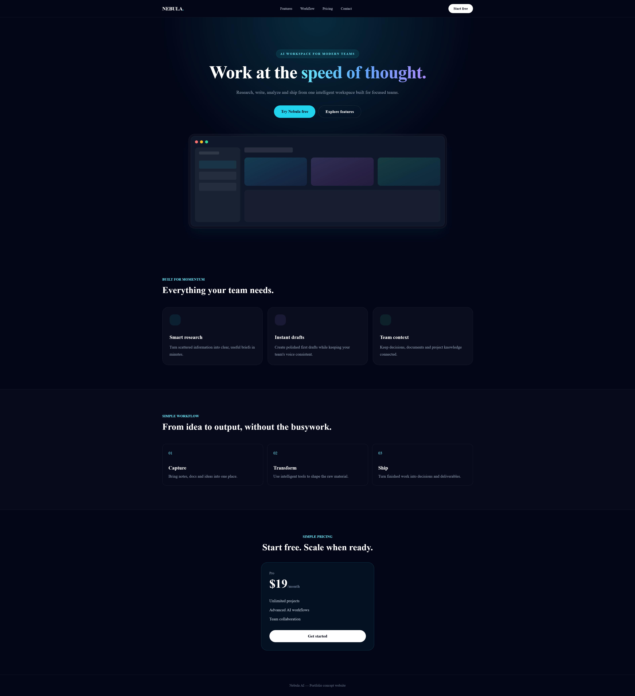
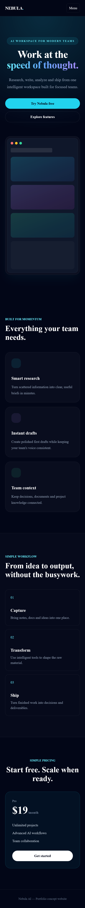

# Nebula AI — SaaS Landing Page

A modern responsive landing page for an AI SaaS product.

## Preview

## Mobile Preview

## Live Demo

[View Live Demo](https://Bmax13.github.io/nebula-ai-landing-page/)

## Technologies

- HTML5
- Tailwind CSS
- JavaScript
- Responsive Design

## Features

- Responsive layout
- Modern SaaS design
- Hero section
- Pricing section
- Feature sections
- Interactive navigation
- Mobile-friendly layout

## Project

This project was created as a frontend development portfolio project, focusing on responsive design, clean structure and modern UI implementation.
